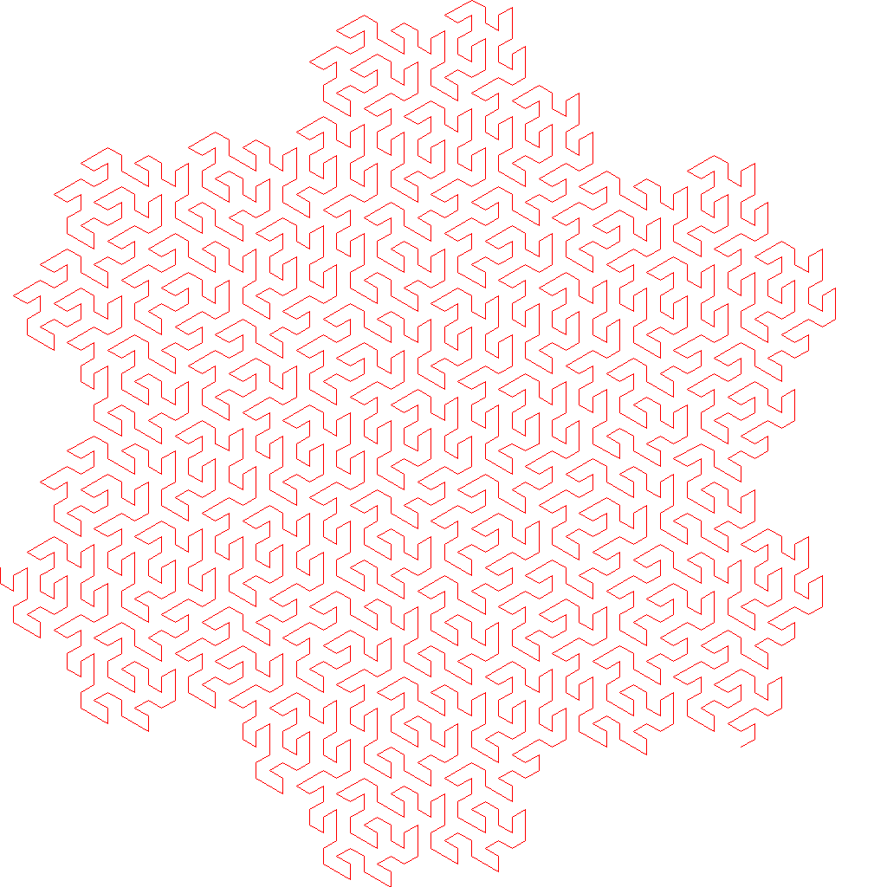
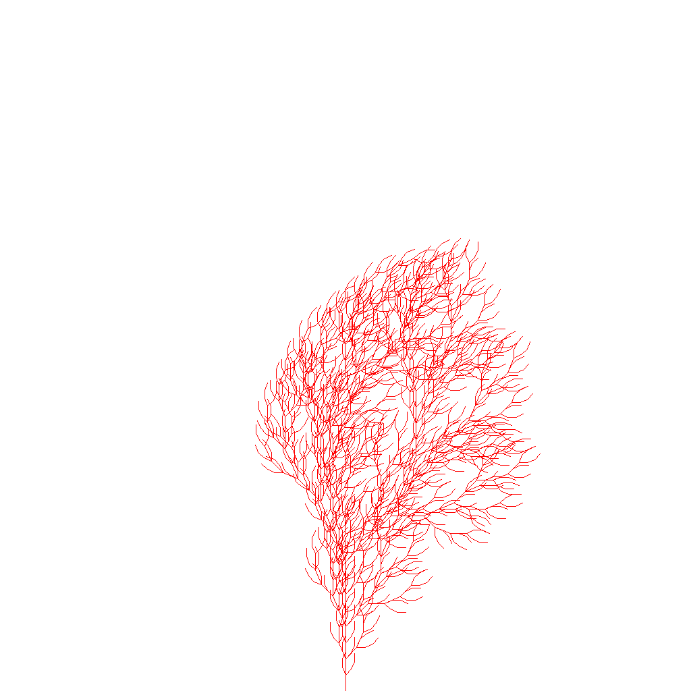
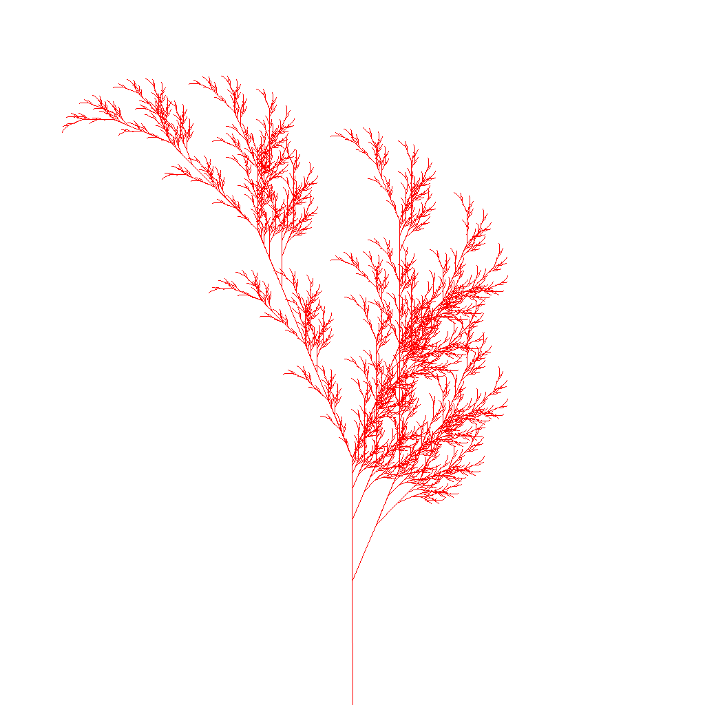
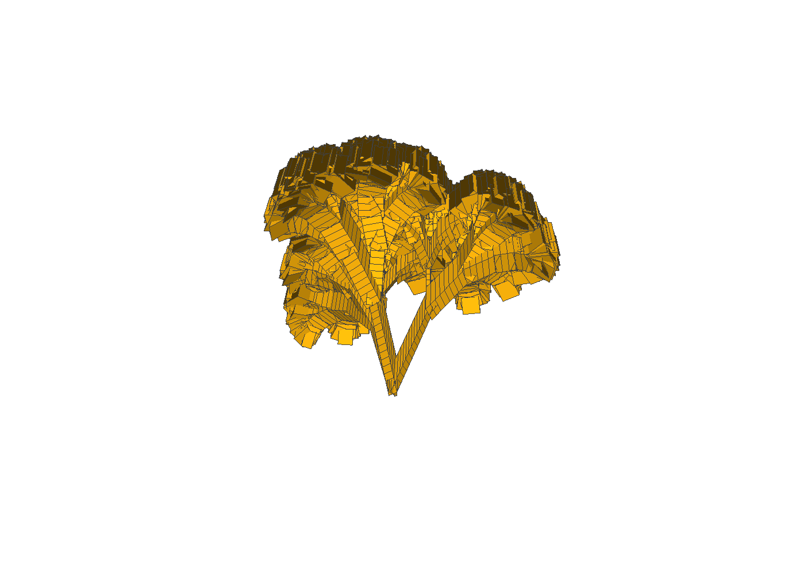
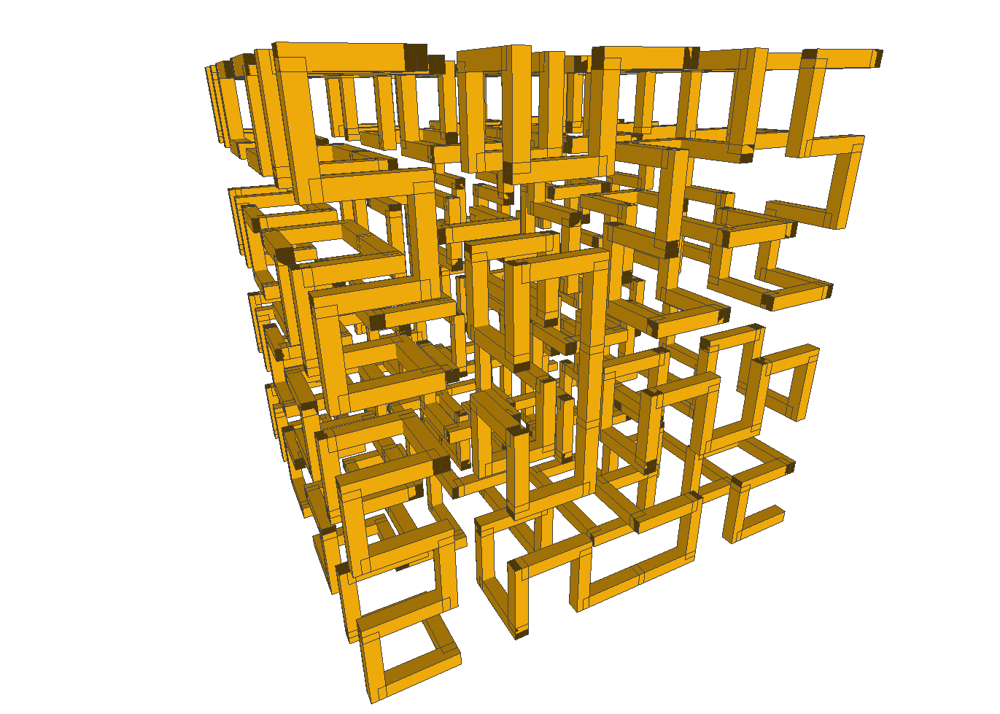

# Library for exploring L-Systems in CPP

## L-System

An l-system or [Lindenmayer System](https://en.wikipedia.org/wiki/L-system) is a formal grammar for describing a set of rules.
Those rules can be interpreted in many ways but one of the most interesting ways
is to render images or build 3D models.

The canonical text, written by Lindenmayer is The Algorithmic Beauty of Plants (ABOP) and can be downloaded
from [here](http://algorithmicbotany.org/papers/#abop). This site has a wealth of information for
people interested in L-Systems.

## The Code

The code here seeks to render the first 20 or so examples in the ABOP.

The code is split in to `lsystemexe` (command line interface to a set of test cases) and `lsystemlib`
(a library for the loading, interpreting and rendering of L-Systems). The `tp` folder contains third
party code:

* [cxxopts](https://github.com/jarro2783/cxxopts) - parsing options in a C++ application
* [glm](https://glm.g-truc.net/0.9.9/index.html) - OpenGL based maths library
* [stb](https://github.com/nothings/stb) - header file based utility library
* [doctest](https://github.com/onqtam/doctest) - unit test library (only used if LSYSTEM_BUILD_TESTS is defined in CMake)

All L-System are `worked on` like this

```cpp
    exunit::lsystem::LSystem system(plant.axiom, plant.rules);
    system.Iterate(plant.itererations);

    PNGTurtle turtle(width, height, startx, starty, branchangle, branchlength);
    turtle.Render(system.GetState());
```

* create an lsystem with it's initial axiom and an array of rules
* ask the system iterate n times
* construct a turtle to render the final state of the l system.

The `axiom` or starting condition is a string for example "A".

The rules are a `std::vector` of strings which take the for `A=>B` which can be read as `A` transforms to `B`. 
These rules can become incredibly complex and, as I found, less than intuitive. None the less lsystems are
an interesting area to explore. Small changes to the rules have dramatic affect on the output.

## Rendering

Since lsystems take a set of transforms to repeatedly apply to a string these strings need to be
interpreted in order to render their output.

The code contains two turtles (2D and 3D) that interpret the resultant string to move the `pen` around the canvas. The
interpretation follows, where possible, the naming conventions within the ABOP book. There is a third turtle called
`boundsturtle` that interprets the string and returns the bounding box of the pen. I can't see any way
to work out the area/volume of an lsystem without rendering it, is it NP complete? No idea. 
Bounds Turtle worked around that problem.


## Building

The code should build on Windows, macOS and Linux. The code uses CMake to create project files.

## Output.

Here are some images that the code outputs.



    AXIOM: F
    RULES: F=>F+I++I-F--FF-I+
           I=>-F+II++I+F--F-I




    AXIOM: F
    RULES: F=>FF-[-F+F+F]+[+F-F-F]



    AXIOM: X
    RULES: X=>F-[[X]+X]+F[+FX]-X
           F=>FF



    AXIOM:A,
    RULES:A=>[&FL!A]/////'[&FL!A]///////'[&FL!A]
          F=>S ///// F
          S=>FL
          L=>



    AXIOM:A
    RULES:A=>B-F+CFC+F-D&F^D-F+&&CFC+F+B//)
          B=>A&F^CFB^F^D^^-F-D^|F^B|FC^F^A//
          C=>|D^|F^B-F+C^F^A&&FA&F^C+F+B^F^D//
          D=>|CFB-F+B|FA&F^A&&FB-F+B|FC//